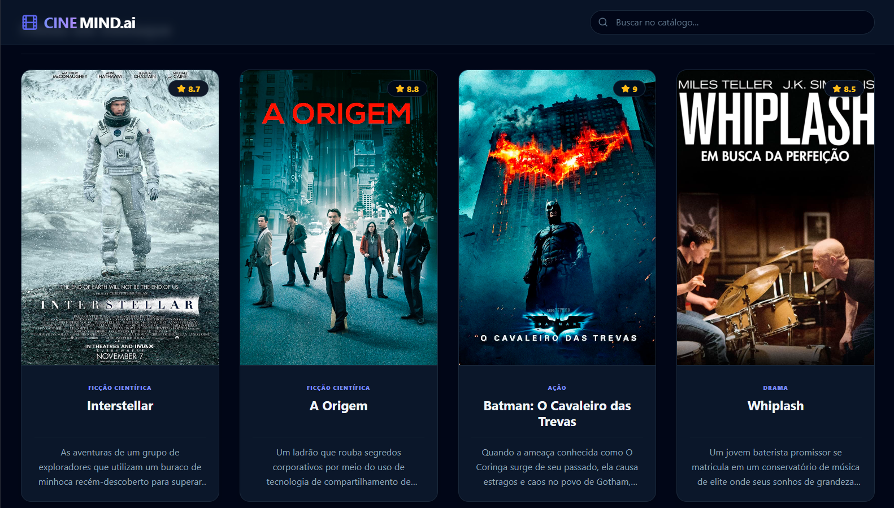

<h1 align="center">🎬 CINEMIND.ai — Buscador de Filmes Inteligente com Inteligência Artificial</h1>

<p align="center">
  O <strong>CINEMIND.ai</strong> é uma plataforma moderna de recomendação e busca semântica de filmes, que utiliza inteligência artificial generativa para entender o humor, desejos e o contexto digitado pelo usuário, entregando os títulos perfeitos da lista.
</p>

<p align="center">
  Este projeto foi totalmente desenvolvido por mim, <strong>Jean Pedro</strong>.
</p>

<div align="center">
  <table>
    <tr>
      <td style="border: none;">
        
      </td>
      <td style="border: none;">
        
      </td>
    </tr>
  </table>
</div>

<p align="center">
  <a href="#" target="_blank">
    
  </a>
</p>

## 🎯 Objetivo

Este projeto foi desenvolvido com o objetivo de construir uma aplicação Web SPA (*Single Page Application*) moderna, explorando o ecossistema do React com TypeScript e implementando a integração direta com modelos LLM de inteligência artificial da Google no front-end em tempo real.

## 🚀 Sobre o Projeto

O CINEMIND.ai quebra o padrão das buscas tradicionais por palavras-chave exatas. Através da engine do Google Gemini, a aplicação interpreta frases naturais complexas, sentimentos e descrições subjetivas de diretores ou tramas, filtrando o catálogo de forma instantânea através de uma estrutura JSON limpa.

- 🤖 **Engine Inteligente:** Integração direta com a API do Google Gemini (`gemini-2.5-flash`).
- ⚡ **Performance e Tipagem:** Construído com Vite e TypeScript para carregamento e desenvolvimento ultrarrápido.
- 🎨 **Interface Premium:** Estilização escura e sofisticada com foco total em usabilidade (UX) usando Tailwind CSS.
- 🔎 **Filtro Duplo:** Permite buscas clássicas por digitação no catálogo ou busca semântica contextual via IA.

## 🛠️ Tecnologias Utilizadas

<p align="left">
  
</p>

- **React & TypeScript:** Arquitetura base baseada em componentes tipados e controle de estado eficiente.
- **Vite:** Ferramenta de build e servidor de desenvolvimento otimizado para aplicações SPA.
- **Tailwind CSS:** Utilitários de estilização para construção rápida de interfaces responsivas e fluidas.
- **Google Gen AI SDK:** SDK oficial para comunicação e controle de contexto semântico direto com o Gemini.
- **Lucide React:** Pacote de ícones vetoriais modernos e leves para enriquecimento visual da interface.

## ⚙️ Funcionalidades

- **Busca Semântica Contextual:** A IA analisa comandos abstratos como *"um drama tenso sobre música e obsessão"* e isola títulos específicos como Whiplash.
- **Barra de Pesquisa Tradicional:** Filtro rápido por título que varre o catálogo local dinamicamente sem requisições adicionais.
- **Configuração de Resposta Estrita:** Parametrisação da IA via `systemInstruction` e `generationConfig` para forçar respostas em arrays JSON estruturados com temperatura baixa (0.1).
- **Reset Dinâmico de Estado:** Opção de limpar filtros para restaurar o catálogo aos filmes em destaque instantaneamente.

## 💡 Diferenciais Técnicos

- **Mascaramento e Segurança via .env:** Isolamento seguro de variáveis sensíveis utilizando o padrão de leitura de variáveis de ambiente (`import.meta.env.VITE_GEMINI_API_KEY`) do Vite.
- **Tratamento de Fallbacks de Conexão:** Validação de checagem da API Key com aviso em console e transição amigável para comportamento estático em caso de falha de credenciais.
- **Correção de Clip de Texto (Pixel Perfect):** Ajuste fino de *line-height* e espaçamento vertical (`leading-relaxed py-4`) para impedir que gradientes de cor com `bg-clip-text` cortem pontos de pontuação e caracteres altos.

## 📂 Estrutura de Pastas

```text
├── public/
├── src/
│   ├── assets/           # Imagens dos pôsteres (incluindo 1.png e 2.png)
│   ├── services/
│   │   └── api.ts        # Configuração do SDK do Gemini e lógica da IA (askAI)
│   ├── App.tsx           # Componente principal e interface da SPA
│   ├── index.css         # Configurações globais e diretivas do Tailwind
│   └── main.tsx          # Ponto de entrada do React e renderização do DOM
├── .env.local            # Chave secreta da API do Gemini (Ignorado no Git)
├── index.html
├── package.json
├── tsconfig.json         # Configuração de tipos e caminhos do TypeScript
└── vite.config.ts        # Configuração de build e plugins do Vite
